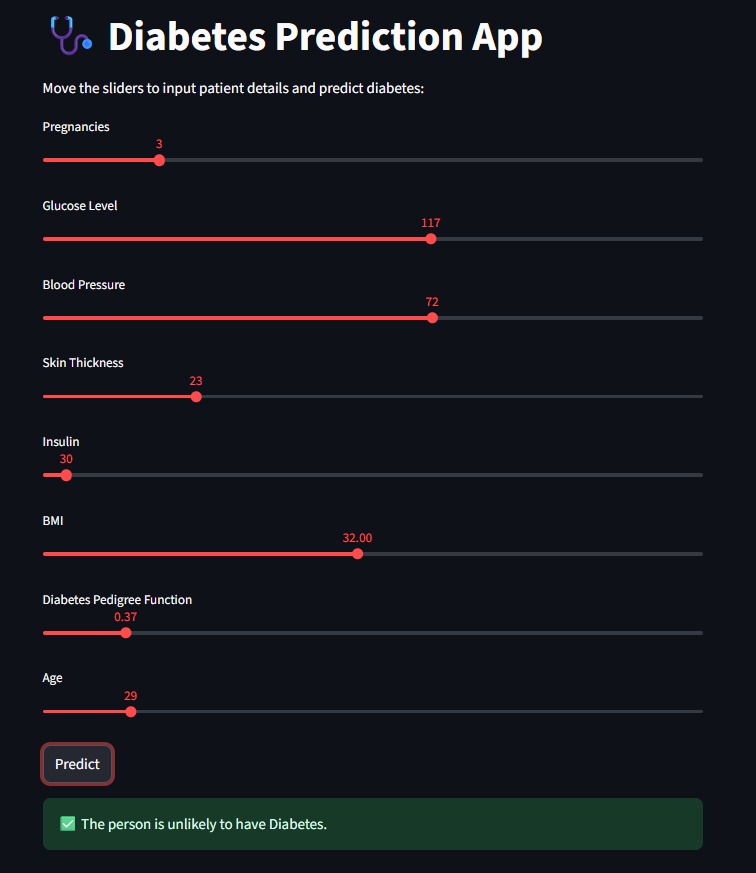

# 🩺 Diabetes Prediction App

This is a **Machine Learning-based web application** built using **Streamlit** that predicts whether a person is likely to have **diabetes** or not.
The prediction is based on several medical input features such as glucose level, BMI, age, and more.

This project is a part of my **Machine Learning learning journey**, where I applied concepts like **data preprocessing, train-test split, model training, and deployment**.

---

## 📊 Features

✔️ **User-Friendly Interface** – Enter health details through sliders and input boxes.
✔️ **Prediction with ML Model** – Uses a trained **Support Vector Classifier (SVC)** model.
✔️ **StandardScaler Integration** – Ensures input data is scaled properly before prediction.
✔️ **Interactive Web App** – Powered by **Streamlit** for real-time prediction.
✔️ **Free Deployment** – Runs seamlessly on **Streamlit Cloud**, accessible via web browser.

---

## 📂 Repository Structure

```
📦 diabetes-prediction-app
│── app.py                # Streamlit app frontend
│── diabetes_model.pkl    # Trained ML model
│── scaler.pkl            # StandardScaler (for input scaling)
│── requirements.txt      # Dependencies for deployment
│── README.md             # Project documentation
```

---

## ⚙️ Installation & Usage

### 🔹 Step 1: Clone the repository

```bash
git clone https://github.com/abdulwasay8905/diabetes-prediction-app.git
cd diabetes-prediction-app
```

### 🔹 Step 2: Install required dependencies

```bash
pip install -r requirements.txt
```

### 🔹 Step 3: Run the Streamlit app locally

```bash
streamlit run app.py
```

📌 App will be available at:
👉 `https://dqeee3mwbwbnamcnnbj7ql.streamlit.app`

---

## 🌍 Deployment on Streamlit Cloud

This app is deployed for **free** on [Streamlit Community Cloud](https://streamlit.io/cloud).

🔹 Deployment Steps:

1. Push the repository to **GitHub**.
2. Log in to [Streamlit Cloud](https://streamlit.io/cloud).
3. Click **New App** → select repo → branch → app file (`app.py`).
4. Add `requirements.txt` for dependencies.
5. Deploy & get a **public URL** 🌍.

---

## 📦 requirements.txt

```txt
streamlit==1.37.0
pandas==2.2.2
numpy==1.26.4
scikit-learn==1.3.2
joblib==1.4.2
```

---

## 🧑‍💻 How it Works

1. User enters their health details like glucose, insulin, BMI, and age.
2. The data is **scaled** using the saved **StandardScaler**.
3. The trained **ML model (SVC)** predicts the result.
4. The app shows whether the person is likely to have **Diabetes: Yes / No**.

---

## 📸 Demo



---

## 👨‍💻 Author

**Abdul Wasay**

* 🌐 [GitHub](https://github.com/abdulwasay8905)
* 💼 [LinkedIn](www.linkedin.com/in/abdul-wasay-2a602329b)

---

✨ This project is part of my **Data Science & Machine Learning learning journey**.
Next steps: working on **classification & regression problems**, model improvement, and **more ML apps** 🚀

---

